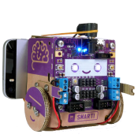

# The Crafty Robot Smartibot robot

The Crafty Robot Smartibot was a kickstarter user-assembled robot launched on [Kickstarter](https://www.kickstarter.com/projects/460355237/smartibot-the-worlds-first-ai-enabled-cardboard-ro). 
It's claim to fame is that it's a cardboard robot, which in practice means 
that the robot shell and wheels are cardboard and the electronics are stock 
electronics.

The Bluetooth connection is via the Nordic Semiconductor NRF system; the device 
is Bluetooth LE, but it includes a service with a transmit and receive characteristics; 
these are used to send JavaScript commands to the device. The device specialization 
looks just like a terminal because that's what the device emulated.

The device uses the *Espruino* system to run JavaScript on the device. Somewhat 
confusingly, you will often see code like this:

    var smarti = require("Smartibot");
    smarti.setLEDs([255,0,0], [0,255,0

## Changes to the require("Smartibot") statement
First run this statement:

    var smarti = exports = {}

This is the same as the Pre-Smarti button, so you don't have to remember it!

Then send the entire Smarti module to the device. The easiest way is to press the Smarti button! Otherwise, get the file, and copy it into the terminal area.

Once you do this, you should be able to use the smarti object to control your device. 

##Technical details about require()

The *require* statement is normally handled by the Espruino development system. This program doesn't include the entire development system but does include the Smartibot module as an option to download to the board.  Because the smarti.js module is fairly simple, you can simply send the module directly to your board. First you have to define the "exports" object. The exports object will be created as the smarti object.

## Running Smartibot
Set the screen to show three buttons wide; this results in the best set of controls. There are sliders for the "eyes". You can set exactly values for the two drive motors (marked Left and Right) and the LED eyes and the 
light-up headphones. 

# Screen Shot

# Links
Some useful links to learn more about the Smartibot robot:

* [Crafty Robot](https://thecraftyrobot.net/collections/smartibot)
* [Espruino](http://www.espruino.com/Smartibot)
* [Kickstarter](https://www.kickstarter.com/projects/460355237/smartibot-the-worlds-first-ai-enabled-cardboard-ro)
* [Espruino Module](https://www.espruino.com/modules/Smartibot.js)
* [Reddit](https://www.reddit.com/r/Smartibot/)
* [License](https://www.espruino.com/modules/LICENSE)

The license is required for the Espruino module only.
