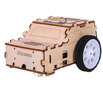

# MiniCar from Elegoo



The MiniCar is wooden-shell robot car with fairly standard Arduino controller.  It includes two DC motors (not servos), two RGB headlights, a small buzzer, and a front sensor and line sensors. 

The Bluetooth connection is via BluetoothLE using a fake-serial-port style command set. Instead of each feature (like the headlights) being controlled via a seperate characteristic, there's just a single string characteristic to write, and one to read.

The actual commands look like

```
    ${TURN[1][255]}
```

where the '1' means to go forward and the 255 means to go as fast as possible.

From a chip and internals point of view,
1. It's called the ...BT16 because it uses the DX-BT16 4.2 Bluetooth module. This module is what supports the (IMHO) weird serial format. It's also how the Arduino Robot Brains can just read and write to the serial interface and yet have a Bluetooth LE service/characteristic.
2. There's a ```{V[?]}``` voltagea command which will return the voltage of pin A3. This command isn't exposed in the UI because the actual pin is buried in the car; there's no obvious exposed pin that can be examined. 


The specialization uses a UIList and a set of Commands to create a decent-looking grid of buttons to control the car. 

# Screen Shot


# Links
Some useful links to learn more about the Skoobot robot:

* [Web site](https://www.elegoo.com/product/elegoo-robotic-wooden-car-kit-with-nanoarduino-compatible-line-tracking-avoiding-obstacle-mobile-controlling-and-graphical-programming-intelligent-and-educational-toy-car-kitstem-toys-for-kids/)
* [Facebook](https://www.facebook.com/ElegooOfficial)
* [Github code](https://github.com/elegoogroup/miniCar)
* [Hackster](https://www.hackster.io/elegooofficial/products)

