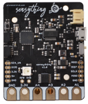

# Protocentral Sensything device

The Sensything is designed to be an Arduino-compatible data collector with a simple configuration scheme and
a simple app to control everything. It's intended to support a variety of QWIIC-compatible sensors. 
Out of the box, the four analog channels on the bottom will be output. The output are in *volts* (the
official Sensything app has them in milliVolts).

# Example
In this screenshot, I connected up a potentiometer, setting the two outer pins to the ground
and the 3.3V edge connectors and the center pin (which I know is connected to the potentiometer's 
wiper) to the A1 edge connector. Then I moved the potentiometer back and forth slowly.

In the program I opened up the Analog Data Tracker section and clicked Notify to start the graph
and the table data running.

# Pairing and usage details

Pairing is not required with the Sensything. The device works without problems. 
The most finicky problem is that the default Arduino code has large (1 second) delays built in; 
you can get slow data out without much trouble, but it's not suitable for "twitchy" results
unless you re-compile the built-in Arduino code.

Note that when you connect to the Sensything, the LED will suddenly go black. This is normal. When
the program disconnects from the Sensything, the LED will start again.

# QWIIC details

The QWIIC sensor support has not been tested with this program. Based on the code in the Sensything GitHub
account, I don't believe that the QWIIC data will display via the app using the default configuration.

# Useful links
* [Web site](http://Sensything.com)
* [Github](https://github.com/Protocentral/protocentral_sensything)
* [Github BLE details](https://github.com/Protocentral/protocentral_sensything/tree/master/software/Sensything_esp-idf/Sensything_ble)
* [Hackster.io blog post 2018](https://blog.hackster.io/sensything-provides-sensors-processing-and-wireless-on-a-single-board-4699efb22128)
