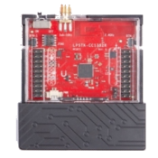

# TI SensorTag CC1352

This is the latest 2019 model TI SensorTag. New in this version: the Bluetooth is very different (for example,
the temperature and humidity which had been on the same characteristic before are now on seperate services and characteristics, and the value are presented as simple processed floats instead of raw sensor data. 
The SensorTag is a small device created by TI in order to demonstrate the cababilities of their microprocessors when 
dealing with a variety of on-board sensors. 

This SensorTag uses 2 AAA batteries for power. It is larger and heavier than any previous SensorTag.
# Example

# Pairing (code 0) and usage details
The device does not need to be paired with Windows before it can be used.

The SensorTag can be a little finicky to connect; sometimes you have to try several times, 
pressing the pairing button. 

If you are creating your own program to read SensorTag data, you have to do a two-step setup to 
get data. You have to both enable the sensors with the configure option and must also enable 
the Bluetooth notifications. This is done for you automatically in the program.

# Sensor Details
The device inludes the following sensors. 

* [**ADXL362** Accelerometer](https://www.analog.com/en/products/adxl362.html) from Analog Devices
* [**DRV5032** Hall-Effect Sensor](http://www.ti.com/product/DRV5032) from TI
* [**HDC-2080** Humidity Sensor](http://www.ti.com/product/HDC2080) from TI
* [**OPT3001** Ambient Light Sensor](http://www.ti.com/product/OPT3001) from TI

Weirdly, the Hall Effect sensor (magnetometer) does not show up as any of the services on my version.
