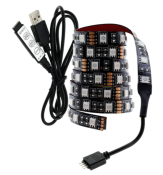

# Triopnes-compatible LED lights

Many popular Bluetooth light bulbs use the same underlying "Triones" protocol. For example, 
[this one](https://www.aliexpress.com/item/33028717755.html?spm=a2g0s.9042311.0.0.14494c4dl4bzl5)
is available from Ali Express. Weirdly, a lot of the Bluetooth smart light bulbs from 
Ali Express are in fact the exact same bulb (I know this becuase I've now got a drawer
full of them from different sellers and they are identical right down to the packaging).
Look for bulbs that use the "HappyLighting" app; they seem to often be Triones compatible.

There are three tabs for Triones devices: color, demo modes, and white. 

# Color tab

The Color tab lets you set the exact color of the bulb using a color picker. You can
point to the color you want or you can type in the red, green, and blue values directly.

# Demo mode

Only some Triones-compatible bulbs will do the demo modes, and unfortunately there doesn't seem 
to be any way to tell which bulbs support it and which do not.

# White tab

The white tab is used when you just want pure white light. That tab also includes a power 
switch to turn the bulb on and off. When a bulb is off, just setting the color won't
turn it on; you have to also press the power switch.